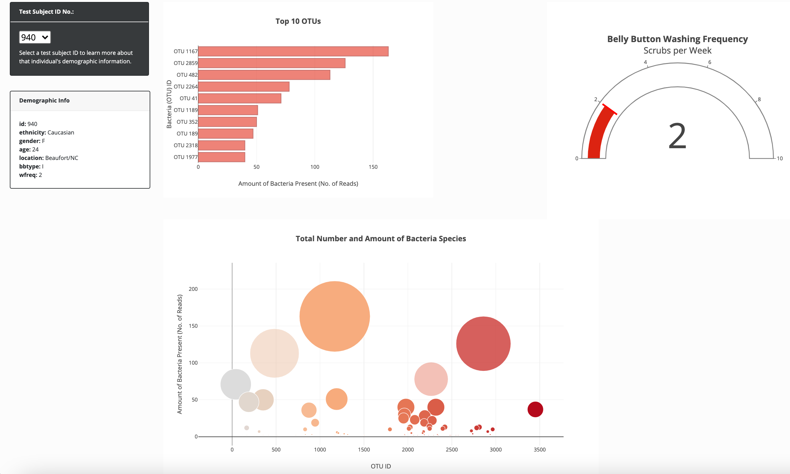

# Belly Button Biodiversity

## https://alexarnold630.github.io/SMU_Homework//15-Interactive-Visualizations-and-Dashboards/Submission/Code/index.html

## Background
Build an interactive dashboard to explore the Belly Button Biodiversity dataset, which catalogs the microbes that colonize human navels.

## Technologies Used
- plotly.js
- HTML/CSS

## Objectives
1. Use the D3 library to read in samples.json.
2. Create a horizontal bar chart with a dropdown menu to display the top 10 OTUs found in that individual.
3. Create a bubble chart that displays each sample.
4. Create a gauge chart to plot the weekly washing frequency of the individual.
5. Display the sample metadata, i.e., an individual's demographic information.
6. Display each key-value pair from the metadata JSON object somewhere on the page.
7. Update all of the plots any time that a new sample is selected.

### About the Data
Hulcr, J. et al.(2012) A Jungle in There: Bacteria in Belly Buttons are Highly Diverse, but Predictable. Retrieved from: http://robdunnlab.com/projects/belly-button-biodiversity/results-and-data/

